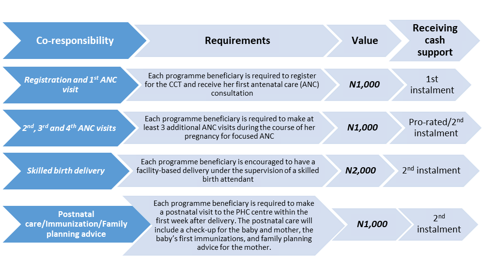
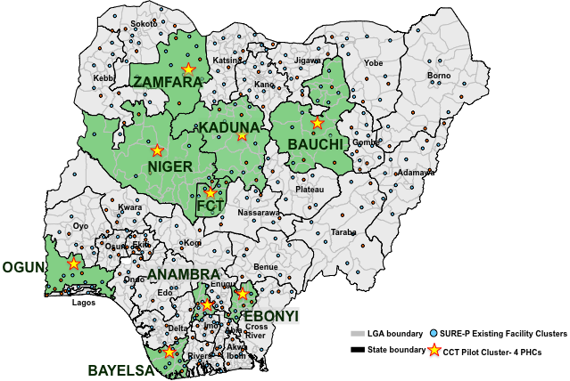

```{r setup, include=FALSE}
library(knitr)
opts_chunk$set(echo = FALSE)

## Code chunks to enable autonumbering of tables and figures.
tn = local({
  i = 0
  function(x) {
    i <<- i + 1
    paste("<table><caption>", 'Figure ', i, ': ', x, "</caption><colgroup><col width='100'></col></colgroup><thead><tr class='header'></tr></thead><tbody></tbody></table><p>", sep = '')
  }
})
knit_hooks$set(fig.cap = function(before, options, envir) {
  if(!before)
    tn(options$fig.cap)
})
default_output_hook = knit_hooks$get("output")
knit_hooks$set(output = function(x, options) {
  if (is.null(options$fig.cap) == F)  
    x
  else
    default_output_hook(x,options)
})

# number tables
# from http://stackoverflow.com/a/18672268/1036500
to = local({
  i = 0
  function(x) {
    i <<- i + 1
    paste("<table><caption>", 'Table ', i, ': ', x, "</caption><colgroup><col width='100'></col></colgroup><thead><tr class='header'></tr></thead><tbody></tbody></table><p>", sep = '')
  }
})
knit_hooks$set(tab.cap = function(before, options, envir) {
  if(!before)
    to(options$tab.cap)
})
default_output_hook = knit_hooks$get("output")
knit_hooks$set(output = function(x, options) {
  if (is.null(options$tab.cap) == F)  
    x
  else
    default_output_hook(x,options)
})
```

```{r load, message=FALSE}
invisible(
  lapply(c('kfigr', 'magrittr', 'rprojroot', 'tidyverse'),
         library,
         character.only = TRUE))
thisProj <- has_file('cct.Rproj')
source(find_root_file('scripts', 'helpers.R', criterion = thisProj))
```

**Authors**  
Chioma Oduenyi^1^^,^ ^2^^,^ ^3^, Victor Ordu^1^^,^ ^4^ and Ugo Okoli^2^^,^ ^3^

**Author Affiliations**  
^1^Global Health and Medical Consultants Limited, Nigeria. ^2^SURE-P MCH Project Implementation Unit, National Primary Health Care Development Agency, Abuja, Nigeria. ^3^Jhpiego, Nigeria-affiliate of Johns Hopkins University, ^4^National Environmental Standards and Regulations Enforcement Agency, Nigeria.


## Abstract
**Background**  
This paper provides insights into the design and implementation of the Subsidy Reinvestment and Empowerment Programme on Maternal and Child Health (SURE-P MCH) Conditional Cash Transfer (CCT) pilot programme in Nigeria. Operational processes of the CCT programme from design to enrollment and pay-out were assessed independently to inform future CCT designs and implementation.   

**Methods**  
This study combined a desk review of SURE-P MCH CCT operational documents and a retrospective descriptive and cross-sectional survey of 314 primary beneficiaries of the CCT scheme from 29 SURE-P MCH CCT designated health facilities between June – July 2015. The desk review understudied the programme implementation manual (PIM), and several CCT monthly reports and articles obtained from the project management unit (PIU) while a structured questionnaire of (16) questions was used for face-to-face interviews with (30-33) CCT primary beneficiaries drawn from each of eight (8) participating states of Anambra, Bauchi, Bayelsa, Ebonyi, Kaduna, Niger, Ogun, and Zamfara and the Federal Capital Territory (FCT)-Abuja. Findings were analyzed and reported using R statistical package (version 3.1.2). Subsequently a SWOT analysis was conducted to highlight strengths, weaknesses, opportunities and threats of the CCT scheme. Hence, key challenges were identified and recommendations provided for future CCT design and implementation in Nigeria and other settings. 

**Results**  
The SWOT analysis indicated that the CCT programme had a robust design with huge potentials of operational effectiveness if implemented as designed, however, the programme was inundated with several implementation challenges. Though 65% of beneficiaries perceived CCT pay-out events as orderly and well-organized (p < 0.001), yet, the events were marred with inconsistencies and irregularities resulting in large crowds and increased waiting time for beneficiaries. Only 40% of beneficiaries received the complete N5,000 (USD30) cash incentive, 28% received only N1,000 (USD6) while others received either N2000 (USD12), N3000 (USD18) or N4000 (USD24).  

**Conclusion**  
The CCT pilot programme had a robust design following a proof of concept phase that preceded the roll-out of the pilot programme. However, its implementation was marred with several challenges ranging from untimely release of funds, limited monitoring and evaluation and other operational challenges. Future CCT programmes should understudy the SWOT analysis presented in this paper to improve design and implementation of CCT programmes.

_**Key Words:** SURE-P MCH, Conditional Cash Transfers, operational processes, SWOT analysis, efficacy and effectiveness_

## Background 
Nigeria's high maternal mortality of 576 per 100,000 live births and infant mortality of 70 per 1000 live births [@MICS2017; @NPC_ICF] remain worrisome and reflects inequality in maternal and infant mortality due to poverty. Hence one strategy to fight health inequality due to poverty is conditional cash transfer (CCTs) [@cohen]. In a bid to reverse the worrying trend, the Federal Government of Nigeria (FGN) initiated the SURE-P maternal and child health programme (SURE-P MCH) which combined supply and demand-side interventions. Initially launched in 500 primary health care (PHCs) facilities across Nigeria's 36 states and the Federal Capital Territory (FCT) and later scaled to 1000 facilities [@worldbank]. As part of the demand –side intervention, a conditional cash transfer (CCT) component was introduced as a pilot programme to increase demand for basic maternal, newborn and child health (MNCH) services rather than poverty reduction as emphasized by earlier CCT schemes [@okoli]. The CCT scheme was implemented in Nigeria's Federal Capital Territory (FCT), Abuja and 8 states of the federation; Anambra, Bauchi, Bayelsa, Ebonyi, Kaduna, Niger, Ogun, and Zamfara – for a geographic spread. The CCT scheme with an annual budget of over N100,000,000 (USD 602,410), was designed to incentivize enrolled beneficiaries who fulfil a set of four co-responsibilities along the continuum of care for MNCH services in designated PHCs to reduce the impact of economic barriers to access to health services e.g. transportation to the PHC and out-of-pocket expenses[@yildirim]. Pro-rated cash support of up to N5,000 (approximately USD 30) was provided to qualified pregnant women who go through the continuum of care, from antenatal through post-natal care. The value of N5,000 or USD30 as at year 2012 was determined by average estimates of costs incurred by pregnant women to access and utilize the facility, drawn from findings of the proof-of-concept phase [@okoli].

Most CCTs are targeted at disadvantaged or vulnerable people as investments in human capital and in addition to providing immediate poverty relief [@yildirim]. The last two decades has seen an upsurge in the use of conditional cash transfers (CCTs) as innovative approaches to deliver social goods to vulnerable populations around the world [@del_carpio; @roelen; @rawlings]. Since, Mexico implemented *Oportunidades* and Brazil's *Bolsa Familia Programme* (BFP), several countries have implemented CCTs from Latin Americas to Asia such as the Janani Suraksha Yojana (JSY) CCT programme in India [@paul] and Indonesia's large-scale CCTs scheme known as Program Keluarga Harapan (PKH) [@kusuma; @cohen]. Sub-saharan Africa such as Kenya has also implemented CCTs and most recently in developed countries such as England and “Opportunity New York City” (ONYC) in the United States [@parker; @vega; @victora; @riccio] As a lead social protection initiative to address poverty and vulnerability, CCT is not totally new to Nigeria. Nigeria has had its own share of CCT schemes at different scales and with varied focus since the 2000s and while some were state-sponsored, others were federal government-sponsored. Prominent among them was the Nigeria's "In Care of the People" (COPE) conditional cash transfer (CCT) programme launched in 2007 across 12 Nigeria's states, targeted at reducing socio-economic vulnerabilities and breaking the cycle of intergenerational poverty [@holmes]. The effectiveness of COPE became questionable when monitor-ing and evaluation (M&E) mechanisms were conspicuously lacking and many challenges found with the programme delivery and infrastruc¬ture which undermined the pro¬gramme's effectiveness [@holmes]. Other previous CCTs programmes include; CCTs to support girl-child education in three Northern states; Kano, Bauchi and Katsina assisted by the World Bank, DFID and UNICEF. Jigawa state, sponsored a disability allowance programme while Bayelsa state sponsored a child savings scheme. Cross -Rivers State also sponsored a CCT programme for poor households and Ekiti State targeted the elderly who do not earn pensions but were above 65 years (though unconditionally) [@holmes]. 

Unfortunately, these schemes have been unsustainable because they were characterized by poor conceptualization and short-term financing mechanism which lasted usually between 1-2 years' timeframe. The schemes also lacked institutional capacity to develop policy, provide guidance, implement effective M&E systems and provide inter-sectoral coordination. Consequently, these lacking mechanisms for accountability and trans¬parency affected the effectiveness of the CCT initiatives as an instrument of social protection in Nigeria [@salman; @holmes]. Despite challenges of previous CCTs programmes in Nigeria, the overwhelming evidence around positive outcomes of CCT schemes around the world [@cecchini], motivated the FGN to implement SURE-P MCH CCT. As at December 2014, the programme enrolled over 40,000 beneficiaries (pregnant women) and disbursed about N108,330,635.00 in the eight pilot states plus the FCT-Abuja. However, the CCT pilot programme which started in April 2013 ended in May 2015 following a democratic transition to a new government regime and gains made by the project may have been reversed within a short time with the discontinuation of the scheme. 

Meanwhile, the current Nigeria government rolled out a new cash transfer programme that paid out N5000 (USD30) cash support to 40,000 poor Nigerians in 20 states that was targeted at addressing poverty in the country under the National Social Safety Nets Project (NASSP) in the presidency [@vanguard]. However, it is not clear whether lessons learned or recommendations from previous cash transfer programmes in the country have been considered during the design and implementation of the ongoing CCT programmes. Countries in Latin America have predominantly provided evidence on reviews of CCT schemes effectiveness and impact on health and findings from these reviews come with limited transferability to the social, cultural, and political environments in sub-Saharan Africa [@owosu; @gaardera]. Overwhelming evidence have evaluated the impact of CCT schemes around the world with some contesting whether they actually alleviate poverty as intended or whether they are just there to promote positive behavioral change [@kusuma; @lagarde]. However, studies that assess the operational efficacy and effectiveness of CCT schemes in low-resource settings are conspicuously lacking [@lagarde].  For global health interventions to increase their likelihood for success, scale, and sustainability, systematic insights on how implementers achieve success, or not; what problems were successfully addressed, or not; or how situational variability affected successes and challenges must be examined [@kusuma]. Our study therefore, independently assessed the operational efficacy and effectiveness of the SURE-P MCH CCT programme in Nigeria and this paper presents useful insights into the design and implementation of the SURE-P MCH CCT for policymakers in future interventions.

## Design of the SURE-P MCH CCT Programme
**Programme Beneficiaries**  
The primary beneficiaries of the CCT Programme were pregnant women who enrolled at designated SURE-P MCH CCT PHCs. However, secondary beneficiaries include their newborns, wider household (including existing children), as mothers contact with health services increased over the period and their husbands were relieved of some out-of-pocket expenses.

**Eligibility** 
All pregnant women whose pregnancy status were confirmed and booked in each participating facility and who were yet to benefit from the CCT program met the eligibility criteria. The CCT Pilot programme incentivized beneficiaries with a total of N5000 (approximately USD30) cash support after fulfilling four set of co-responsibilities as detailed in `r figr('fig_coresp', TRUE, type = 'Figure')`.

**Cash Transfers**  
The cash disbursement was designed to be done in two tranches, where each woman receives the first disbursement of N1,000 after registration at a participating PHC. Then the second and final disbursement up to N4,000 according to the co-responsibilities completed for ANC, delivery with skilled birth attendant, postnatal care, neonate immunization, and family planning advice. 

**Referral to General Hospital**
Following the design of the CCT programme, beneficiaries who enrolled in the CCT programme were entitled to free care at secondary health facility (general hospital) in their cluster when referred for elective or emergency obstetric treatment from their PHC. However, the desk review identified that beneficiaries who had complications and were referred to general hospitals faced a lot of hitches and no beneficiaries benefited from this service owing to programmatic challenges.

```{r fig_coresp, anchor = 'figure', fig.cap='SURE-P MCH CCT Co-Responsibilities and Benefits'}

```

**Programme Administration and Operations**
Prior to the CCT implementation, a two-week State Readiness Assessment (SRA) was conducted across all participating states to create awareness and sensitize various stakeholders at the state, local government area (LGA) and ward levels on the SURE-P MCH CCT pilot programme and implementation plans.  In each state, one CCT Technical Officer, one Field Supervisor and two Field Officers were recruited and a State Steering Committee (SSC) comprising of the Honourable Commissioner State Ministry of Health, Ministry of Women Affairs, Ministry of Local Government and Chieftaincy Affairs including Traditional and Religious Leaders, State Director Primary Health Care, State MDGs Focal Person, MSS Focal Person, and SURE-P State CCT Technical Officer was inaugurated to guide the implementation of CCT in each state to ensure strong stakeholder collaboration.

Prior to CCT enrollment and registration of beneficiaries, service providers (Midwives, CHEWs and VHWs) were trained on programme implementation while WDC members in all designated PHCs who were either re-activated or newly formed were given an orientation on the programme processes and what their responsibilities would be. The CCT reporting tools including; Beneficiary Registration Card, CCT Facility Registers, CCT Personal Consultation Forms and CCT Referral Forms were developed and deployed to all participating health facilities prior registration and enrollment of pregnant women.

**CCT pay–roll processes**  
Pay-rolls were usually generated from a spreadsheet containing list of eligible beneficiaries, their registration numbers and the amount of cash support qualified based on pre-conditions met. Prior to pay-out events, SSC, WDC and OICs of health facilities were duly informed about the dates. The pay-roll containing the payment schedule of beneficiaries was usually displayed at the notice board of the health facility to notify eligible beneficiaries about their qualification to receive the cash incentives. Additionally, the CCT technical staff would contact all qualified beneficiaries by telephone and inform them about the proposed pay-out day and also mobilize them for the event. CCT Pay-out information was also sent to the community through the village health workers (VHW) who inform the women about the date  and time for the cash disbursements. The pay-roll was used on pay-out days to invite beneficiaries for their cash disbursements. However several challenges such as omission of eligible participants' names from the pay-roll and irregularities on the pay-roll negatively affected the pay-roll processes.

**Pay-out events**  
The CCT pay-out event was the climax of the CCT programme because that was the day beneficiaries received their cash disbursements and was usually a one-day event but with possible spill-over into the next day. The pay-out event venues were usually organized with different stations in a linear manner to allow benefiting women move in a chronological manner for accreditation and validation before receiving their cash support. Thereafter, the CCT beneficiary receives their accrued cash support from bank cashiers who were present at the venues and working with the support of CCT operational staff. When a woman receives a total of N5000 (USD30) cash support having fulfilled all four co-responsibilities, the CCT registration card was retrieved from her and archived with the project. However, following the deviation of the cash disbursements from two installments to single payment for several beneficiaries, the CCT pay-out events attracted high numbers of women who are qualified to receive their cash at the same time and consequently, resulting in the over-crowding of pay out events and resulting in long waiting times for beneficiaries.

## METHODS
**Study Design**  
The study was a combination of a desk review of SURE-P MCH CCT operational documents and a descriptive cross-sectional, retrospective survey of CCT primary beneficiaries using face-to-face interviewer administered questionnaires to elicit responses. The desk review understudied the SURE-P MCH programme implementation manual (PIM), and several SURE-P MCH CCT monthly reports obtained from the project management unit (PIU) while a structured questionnaire of (16) questions was used for the face-to-face interviews with CCT primary beneficiaries. At the end of the desk review and interviews, a SWOT analysis was applied to the study findings to identify key strengths and weaknesses of the CCT scheme as well as opportunities and threats in order to identify key challenges and provide recommendations for future design and implementation of CCT Programmes in Nigeria and other settings. 

**Study Population**  
Study population was drawn from 37 participating CCT pilot PHC facilities in FCT-Abuja and eight (8) participating states of Anambra, Bauchi, Bayelsa, Ebonyi, Kaduna, Niger, Ogun, and Zamfara (`r figr('fig_map', TRUE, type = 'Figure')`). However, following security and accessibility challenges, assessors were unable to reach all four (4) facilities in some states like Bauchi, Kaduna, Niger, Ogun and Zamfara, hence respondents were drawn from only 29 PHC facilities out of the 37 participating facilities. Respondents were pregnant women or nursing mothers who enrolled in the CCT programme during the pilot period from April, 2013 to May 2015 and who received cash incentives for meeting any of the four co-responsibilities. 

**Sampling**  
```{r consolidated_overview}
consolidatedCsv <- file.path(here::here(), 'data', 'consolidated data.csv')
consolidated <- read.csv(consolidatedCsv, stringsAsFactors = FALSE)

```

A list of all women who enrolled in the pilot programme with their telephone contacts served as the sampling frame from which a table of random numbers generated with the Mersenne-Twister system was used to recruit participants into the study and participants who could not be reached on phone were replaced from the sampling frame by simply repeating the table of random numbers. The sampling frame consisted of all `r nrow(consolidated)` CCT pilot enrollees (`r figr('table_enrolled_by_state', TRUE, type = 'Table')`).

```{r table_enrolled_by_state, anchor = 'table', tab.cap = 'CCT Pilot Enrollees by State'}
table(consolidated$state) %>% 
  data.frame() %>% 
  kable(col.names = c('State', 'No. of Enrollees'))
```

A total of 314 CCT primary beneficiaries were selected using a two-stage sampling technique and 30-33 respondents were allotted to each state and FCT-Abuja. The decision on the sample size for each pilot state was made on the strength of the assumptions of the central limit theorem and resources available for the assessment.  

```{r fig_map, anchor = 'figure', fig.cap='Map of CCT Pilot States depicting the sites surveyed'}

```


**Data collection process**  
Data were collected between June-July 2015 (period when the CCT scheme had already ended) and started with the recruitment of Study Assessors who were trained on the assessment's purpose, scope and objectives, interview process, administration of data collection instrument and techniques for conducting effective focus group discussions. Demographic data was collected on sex, age, religion, ethnic group, marital status, educational status, employment status, number of children and number of pregnancy. Assessors combined English with local languages to elicit responses from participants where and when necessary.

**Data management and analysis**  
<!-- TODO: Something to be fixed in this paragraph -->
Each of the answered questionnaires was coded and entered into a spreadsheet. The data collected was subjected to descriptive (i.e. mean, median and mode) and inferential (i.e. Chi-square and ANOVA) statistical treatment. Bivariate analysis and test of statistical significance were carried out using R version 3.1.2. Data from respondents were grouped into themes for analysis thus; CCT operations, CCTs pay- roll processes, CCTs pay- out events and perceived perception by beneficiaries. Finally, information obtained was summarized and presented in tables, charts and frequencies.

**Validity and reliability checks**  
The data collection instruments were put through phased validity which involved pre-testing and field testing of the tools. First the tools were pre-tested and peer-reviewed by internal and external colleagues to ensure internal consistency and validity. Then, a field testing of the questionnaires and survey methodology was done in one of the non-participating CCT facilities in FCT-Abuja with all Assessors who were part of the assessment training. Findings from the field-testing were incorporated and amended accordingly.

## FINDINGS FROM BENEFICIARY SURVEY
```{r load-data}
df <- readRDS(find_root_file("data", "surveydata.rds", criterion = thisProj))
```

**Demographics**  
31.5% of beneficiaries were unemployed (i.e. housewives), 30.5% traders and 75% had a personal income equal to or less than N10,000 monthly.

**CCT Operations**  
About 22.6% of beneficiaries reported that they heard about the CCT programme from family and friends, while 43% heard from village health workers (VHWs), 18.2% heard from community health extension workers (CHEWs) and 11.1% heard from ward development committee (WDC) members as shown in `r figr('plot_cct-info', TRUE, type = 'Figure')`. The data was statistically significantly across the various pilot states (p < 0.001).

```{r plot_cct-info, anchor = 'figure', fig.cap='Where Beneficiaries first heard about CCT'}
gg <- make_plot("cct.info")
print(gg)

gg + facet_wrap( ~ state)
```

<br>

```{r table_preg-stage, anchor = 'table', tab.cap = 'Pregnancy Stage at CCT Enrolment'}
stage <- data.frame(table(df$preg.stage)) %>% 
  mutate(percent = round(Freq /sum(Freq) * 100, 2))
kable(stage, col.names = c('Stage at Enrolment', 'No.', '%'))
```

Most beneficiaries were enrolled in the pilot within the first 2 trimesters of their pregnancies (93%, `r figr('table_preg-stage', TRUE, type = 'Table')`), adequate information on their co-responsibilities was given to them at enrolment and they generally attested to the regularity of their CCT records . 

```{r, eval=FALSE}
print(make_plot(
  "info.coresp",
  title = "Figure 4: Adequate information on Co-responsibilities given"))
```


```{r, eval=FALSE}
print(make_plot(
  "same.record",
  title = "Figure 5: Record on CCT card same as that in Register"))
```
  

Eighty six percent (86%) of respondents stated that they had no complaints about the programme at enrolment while majority of the women (88.7%) reported finding the CCT process to be easy – from enrolment to pay-out.

```{r complaints, eval=FALSE}
print(make_plot(
  "complaints",
  title = "Figure 6: Complaints on CCT Enrolment"))
``` 
  

**CCT Pay-roll and payout events**

```{r process, eval=FALSE}
print(make_plot(
  "cct.process",
  title = "Figure 7: Perception on CCT Process"))
```

```{r process_table, anchor = 'table', tab.cap = 'Perception of CCT Process', results='asis'}
process <- data.frame(table(df$cct.process)) %>% 
  mutate(percent = round(Freq / sum(Freq) * 100, 2))
kable(process, col.names = c("Perception", "Freq", "%"))
```
  
Local health system structures played a more prominent role in disseminating information on Pay-Out Events with the women being mostly informed via the health facility (34.2%), VHW/CHEW (21.1%) and WDC (9.1%). Significantly, the phone calls from SURE-P CCT were prominent sources of information, according to about 12.1% of the respondents. 95% of the respondents said that the information they received was timely, while 84.8% said that the pay-outs were held as scheduled. In Niger State, most of them complained that the Pay-Out Events did not hold as scheduled (`r figr('table_information-source', TRUE, type = 'Table')` & `r figr('table_payout-on-schedule', TRUE, type = 'Table')`).

```{r table_information-source, anchor = 'table', tab.cap = 'How Beneficiaries Heard About Pay-Out Events'}
heard <- data.frame(table(df$cct.info)) %>% 
  mutate(percent = round(Freq /sum(Freq) * 100, 2))
kable(heard, col.names = c('Source', 'No.', '%'))
```

```{r, eval=FALSE}
print(make_plot(
  "state",
  "payout.onschedule",
  "Figure 8: Were Pay-Outs According To Schedule?"))
```

```{r table_payout-on-schedule, anchor = 'table', tab.cap = 'Were Pay-Outs According To Schedule?'}
onSchedule <- df %$%
  table(state, payout.onschedule) %>%
  data.frame() %>%
  spread(payout.onschedule, Freq) %>%
  rename(State = state)

kable(onSchedule)
```
  
Most of the women said that they were paid the complete N5,000 incentive (39.8%), followed by those who received only N1,000 (28.1%). Most of the respondents who received the incentive were paid in a single instalment. 

```{r, eval=FALSE}
print(make_plot(
  "amount.received",
  title = "Figure 9: Amount Paid To Beneficiaries"))
```
  
There was a statistically significant variation (p < 0.001) amongst the CCT Pilot States of the amount received by the beneficiaries; the highest proportion of those that collected N5,000.00 were from FCT (30.4%) while 38.4% of those that collected only N1,000.00, were from Niger State. It should be noted that the CCT Pilot Programme started in the FCT several months before the other States.

```{r numpayments, eval=FALSE}
print(make_plot("no.of.payments",
          title = "Figure 10: No. of payments"))
## TODO: This would make more sense for the "once" and perhaps the "twice" categories. We would want to know whether lump sum payment was common.
```

There was also a statistically significant variation (p < 0.001) amongst Pilot States of the amount received by the beneficiaries; the highest number of those that collected N5,000.00 were from FCT, followed by Ogun State. Of the beneficiaries that collected only N1,000.00, most of them were in Niger State.  

```{r, eval=FALSE}
gg <- make_plot("amount.received",
          title = "Figure 11: Amount Received Across the Pilot States")

gg + facet_wrap( ~ state)
## TODO: Chart as multifaceted plot
```

 
Out of the CCT enrollees that were not given any money, about an equal number were or were not given any reasons why they were not paid (50.7% and 49.3%, respectively). When analysed on a State-by-State basis, 90%, 75% and 53% of the respondents in Bauchi, FCT and Kaduna Pilot States, respectively, said they were not given any reasons for non-payment. In contrast, beneficiaries from Zamfara, Ebonyi and Anambra Pilot States scored CCT high (83.3%, 80% and 60%) in conveying to them any reason for their non-payment (`r figr('fig_reasons-given-for-non-payment', TRUE, type = 'Figure')`).

```{r fig_reasons-given-for-non-payment, anchor = 'figure', fig.cap='Beneficiaries Given Reasons for Non-Payment'}
gg <- make_plot("reason.given")

gg + facet_wrap( ~ state)

## TODO: Disaggregate according to pilot state
```

  
Pay-out events were largely perceived by the beneficiaries to be orderly and well-organised (65.2%, p<.001); most complaints about the way Pay-Out events were organized came from Bauchi, Ebonyi, and FCT, but statistical significance was not tested because some of the assumptions for the sample could not be met (`r figr('payout_event_description', TRUE, type = 'Table')`).

```{r, eval=FALSE}
print(make_plot(
  "state",
  "payout.organized",
  "Figure 13: Description of Pay-Out Events in Pilot States",
  pos = 'fill'))
## TODO: use proportion rather than absolute counts
```

```{r payout_event_description, anchor = 'table', tab.cap = 'Description of Pay-Out Events in Pilot States', results='asis'}
payOrganised <- df %$%
  table(state, payout.organized) %>% 
  data.frame() %>% 
  spread(payout.organized, Freq) %>% 
  rename(State = state)
  
kable(payOrganised)
```


<!--  Alter the source formatting of the following tables with care!
      For better readability, view them in full screen mode (CNTRL+SHFT+1). -->

Table 6: Strength, Weaknesses, Opportunities, Threat (SWOT) Analysis 

|STRENGTHS                                         | WEAKNESSES                                                                                     |
|--------------------------------------------------|------------------------------------------------------------------------------------------------|
|Improved Health Facility attendance: The CCT programme encouraged community women to register and embrace regular antenatal visit (ANC) and Skilled Birth delivery.                                    | Irregular and Inconsistent pay outs: The pay-outs were highly inconsistent and irregular resulting in large crowds during the events which posed a big challenge.                                                                            |
| Motivator: The CCT programme motivated more women to seek health services and other free medical services provided at SURE-P supported PHCs.                                                          | Non-Payment of Cash Incentives: Another observation was that some of the women interviewed reported not paid their entitlement and some others who had received their first instalment were yet to receive the second instalment.              |
| Beneficiary retention: The CCT Programme contributed immensely in sustaining beneficiary retention throughout the continuum of care as most beneficiaries fulfilled the 4 co-responsibilities. | State Steering Committees (SSC): The SSC meetings were not sustainable as a result of unavailability of imp rest to fund such meetings.                                                                                                   |
| Huge Potential: The design of the CCT Programme to support other supply side interventions helped entrench health seeking behaviours within communities.                                       | Security: Adequate security was not provided for the CCT pay-out events and this placed the paying staff at high risk as well as the cash to be disbursed.                                                                                      |
|                                                  | M & E Framework:  Monitoring of the CCT Pay-out events were limited which delayed relevant programatic interventions.                                                                                                                          |


|      OPPORTUNITIES                              |     THREATS                                                                                     |
|-------------------------------------------------|-------------------------------------------------------------------------------------------------|
| CCT Awareness: There was massive awareness of the CCT programme within the communities and huge acceptance of the health services provided at the primary health facility.                          | Renovation of PHC facilities: Before the SURE-P intervention, some of the PHCs were not accessible but the availability of accessible PHCs renovated by SURE P MCH gave CCT the required boost.                                             |
| Availability of Skilled Health work force at the PHCs: The availability of these health workers stimulated the smooth operation of the CCT.                                                          | Unsustainability of the SURE-P MCH Programme: Continuation of the CCT programme largely depends on the SURE-P MCH project.                                                                                                                          |
| Availability of other supply side incentives such as ‘Mama Kits', free medicines etc further encouraged women to register for the CCT.                                                               | Unavailability of CCT funds at the PIU: Funds budgeted for CCT pay-outs were largely unavailable from the federal government on schedule. This hampered the funds disbursement plans.                                                                |
|                                                 | Discontinuation: A sudden discontinuation of the programme will result in thwarting the numerous gains made and reverse the positive trends achieved so far.                                                                                         |
|                                                 | Distrust for Government: Stoppage of the CCT programme will lead to strong distrust/lack of confidence for government programmes in the future.                                                                                                 |


Table 7: KEY CHALLENGES  

|                                                                                                                                                       |
|-------------------------------------------------------------------------------------------------------------------------------------------------------|
| 1.	Irregular and Inconsistent Pay-Out Events: The CCT pay-out events were highly inconsistent and irregular resulting in large crowds which posed a big challenge for crowd control and management. Owing to the large crowds, women were kept for longer than necessary just to receive their cash support. It was gathered that this problem was as a result of delay in releasing funds to the SURE P MCH Unit.                                  |
| 2.	Security for Cash Disbursements: Adequate security was not provided for the CCT pay-out events and this compromised the safety of the cash being disbursed and placed paying staff at high risk.                          |
| 3.	Non-Payment of Cash Incentives: Several of the women interviewed reported not being paid their entitlement and others who received their first instalment were yet to receive their second instalment. It was later confirmed that the SURE-P MCH PIU had recently received funds and was in the process of conducting another round of CCT pay-out events in the states.                       |
| 4.	State Steering Committees: The SSC meetings were not sustainable as a result of unavailability of imprest to fund such meetings and this impacted negatively on the SSC as it never really carried out its assigned role.  |
| 5.	Monitoring and Evaluation: Monitoring of the CCT Pay-out events were limited which delayed relevant programmatic interventions.               |
| 6.	Additional Data Collection: The additional demand generated by the CCT Programme and CCT reporting tools created additional workload for the participating facilities, which had varying levels of capacity to handle the work.                                                                    |
| 7.	Referrals: Initially the CCT Programme was designed to take care of women who had complications and had to be referred to General Hospitals but this strate gy was marred with a lot of hitches as beneficiaries lamented their frustrations in assessing that level of care.                            |

Table 8: KEY RECOMMENDATIONS  

|                                                                            |
|----------------------------------------------------------------------------|
| 1.	CCT Payment Method: A prudent and effective payment method that delivers quick and prompt payments should be considered to check time wastage, avoid fraud, build trust and simplify the process for pregnant and nursing.        |
| 2.	Regular and Consistent Payment Schedule: There should be a standard guideline for CCT pay-out events. At least, the women should be paid every quarter to shorten the long wait for payments by beneficiaries and restore their confidence in the system. This means that whatever funds earmarked for CCT from inception should be made available to the implementing unit in a timely manner to ensure effective implementation.                                             |
| 3.	Monitoring and Evaluation: There should be strong monitoring of the CCT Pay-out events to address immediate programmatic gaps during implementation. |
| 4.	Auditing: Periodic auditing and independent evaluation of the CCT registers will enhance compliance and adherence to the set conditions. It will reduce the chances of fraud and enhance the overall credibility of the pay-out system.  |
| 5.	Exploring other forms of incentives: As CCT significantly improved demand for health intervention/services in the communities, calls were made for other forms of incentives which could provide long term benefits to beneficiaries e.g. (vocational training/skill acquisition incentives. The CCT Programme should also be weighed with cash-benefit induced pregnancies vis-á-vis other forms of incentives.                                                                  |
| 6.	Involvement of PHC staff in cash-disbursements: This can be considered as it strongly came out in the recommendations from the field that the use of facility management staff will strengthen the process.                       |
| 7.	Programme Continuation: All respondents strongly thanked the government for initiating this laudable intervention and at the same time called for its continuation.                                                                |

 
## DISCUSSION
Social transfers such as CCTs are usually associated with various errors including design and implementation, administrative costs and other secondary consequences [@devereux] however, the SURE-P MCH CCT was designed with novel approaches drawn from similar schemes around the world, yet its implementation appeared to be more complex than its design [@epiafric]. The robust design of the CCT intervention and the proof-of concept phase validates the efficacy of the CCT operations however, implementation challenges affected the effectiveness of the operational processes. Despite implementation challenges, the CCT operational processes were majorly effective as 86% of respondents stated that they had no complaints about the CCT programme at enrolment while another majority (88.7%) opined that the CCT operational processes were easy, from enrolment to pay-out. Hence, most of the respondents expressed satisfaction with the operational processes having perceived the scheme as a successful government programme that should not be discontinued. However, there was still wide spread complaints about the pay-out events being usually overcrowded resulting in long waiting time for beneficiaries.  Respondents reported perceived satisfaction with operational processes but still complained about pay-out events. This twist by respondents corresponds with earlier studies, which documented patient's under-reporting of poor experiences [@kruk]. Meanwhile, the desk review indicated that the delay in disbursing approved funds to the PIU by the federal government complicated issues around the pay-outs,  

Furthermore, women qualified for cash disbursements reported that they were mostly informed about the pay-out events via the health facility (34.2%), VHW/CHEW (21.1%) and WDC (9.1%) and this is consistent with the earlier findings that local health system structures play a more prominent role in disseminating information on Pay-Out Events [@hunter]. Significantly, the phone calls from SURE-P CCT Officers were also prominent sources of information, according to about 12.1% of the respondents and 95% of the respondents reported that the information they received was timely. Unfortunately, beneficiaries who were entitled to free care at the general hospital when referred from their PHC for elective or emergency obstetric treatment faced a lot of hitches as beneficiaries lamented their frustrations in assessing that level of care.

The apparently smooth operational processes that characterized enrolment into the scheme up to pay-out was hampered by irregularities that inundated the pay-out events. These irregularities were reported to be as a result of irregular availability of funds from the federal government, thus the CCT programme deviated from its initial design of two installments disbursements to making single disbursements in reality. Many beneficiaries that were eligible for payments were combined to receive their cash transfers in one installment and this obviously led to the overcrowding experienced at pay-out events. Being that the desk review showed that the CCT disbursements was designed to be conducted in two tranches for each woman, first after registration and secondly after meeting the remaining set of co-responsibilities. However, the single payment in reality thwarted the essence for the design which is to make payments prompt as prompt cash transfers are necessary to build beneficiaries' trust and for the cash to serve its intended purpose of reducing healthcare costs for mothers [@okoli]. The use of a cash and paper based payment system which to track and pay clients, [@mcnabb] heightened the need for adequate security for the cash and staff involved in the pay-out events and also heightens loophole for corruption or fraud to thrive. This also indicate that implementing a CCT programme involves huge administrative and management costs as several staff are usually needed to successfully execute activities at the different levels of the process.


Key Recommencations
1. CCT Payment Method: A prudent and effective payment method that delivers quick and prompt payments should be considered to check time wastage, avoid fraud, build trust and simplify the process for pregnant and nursing. The use of electronic payment methods directly into beneficiary's bank account will reduce overhead costs for hiring several operational staff as well as facilitate the ease of making payments in two installments as planned.
2. Regular and Consistent Payment Schedule: There should be a standard guideline for CCT pay-out events. At least, the women should be paid every quarter to shorten the long wait for payments by beneficiaries and restore their confidence in the system. This means that whatever funds earmarked for CCT from inception should be made available to the implementing unit in a timely manner to ensure effective implementation.
3. Monitoring and Evaluation: There should be strong monitoring of the CCT Pay-out events to address immediate programmatic gaps during implementation.
4. Auditing: Periodic auditing and independent evaluation of the CCT registers will enhance compliance and adherence to the set conditions. It will reduce the chances of fraud and enhance the overall credibility of the pay-out system.
5. Programme Continuation: All respondents strongly thanked the government for initiating this laudable intervention and at the same time called for its continuation.

## LIMITATIONS OF STUDY
This study was limited by the paucity of literature on previous CCTs in Nigeria to support the desk review, though all literature available was considered. Also, the inability to assess more beneficiaries from all 37 facilities following security issues and inaccessibility of some terrain were limiting. However the 29 facilities and 314 beneficiaries assessed still gave a fair assessment of all participating states covered. 

## CONCLUSION
Obviously, the major strength of the SURE-P MCH CCT was its design to complement other supply-side interventions, as this helped to deepen health-seeking behavior, as the free services provided at the facility served as a motivating factor. Evidence shows that for a demand-side intervention such as CCT to be successful, concurrent supply-side inputs should be available [@hunter]. Despite demonstrating a robust design of the CCT programme, its operational processes were marred with numerous challenges including: delay in cash disbursements to qualified beneficiaries owing to delayed replenishment from the federal government; omission of eligible participants names from the pay-roll; irregularities on the pay-roll; over-crowding of pay-out events leading to long waiting times and lack of access to referral facilities in case of emergencies or obstetric complications. Also, the CCT pay-outs lacked a clear monitoring framework that would have helped the programme to make necessary process amendments to improve outcome of the pay-out events. This conspicuous lack of (M&E) mechanisms is similar to COPE's implementation which was also inundated with several service delivery challenges that undermined programme delivery and effectiveness [@victora]. Monitoring programme uptake and performance in each implementing cluster is essential to track and address programmatic challenges which may be the result of operational barriers [@okoli]. 

This study suggests that the CCT pilot scheme motivated positive behavior change towards utilization of MNCH services as affirmed by previous studies [@glassman; @cohen]. However, this paper identified key challenges that marred the operational efficacy and effectiveness of the CCT programme but at the same time provided key recommendations to mitigate such challenges in the future. Future CCT programmes should understudy the SWOT analysis presented in this paper to guide future interventions in Nigeria and beyond.

**Abbreviations**
ANC: Antenatal care; CCT: Conditional cash transfer; CHEWs: Community health extension workers; COPE: Care of the People; FCT: Federal capital territory; MCH: Maternal and Child Health; MDG: Millennium development goals; M & E: Monitoring and evaluation; MNCH: Maternal, neonatal and child health; MSS: Midwives service scheme; PHC: Primary healthcare facility; PIM: programme implementation manual;  PIU: Project implementation unit; R is an open source statistical package developed by The R Foundation for Statistical Computing, SBA: Skilled birth attendance; SSC: State Steering Committee;  SRA: State Readiness Assessment; SURE-P: Subsidy Reinvestment and Empowerment Programme; SWOT: Strength, weaknesses, opportunities and threats; VHW: Village health worker; WDC: Ward Development Committee


**Declarations**

**Ethical approval and consent to participate**
The assessment was initiated by SURE-P MCH management with the approval of the eight participating states and the study protocol was approved by SURE-P MCH ethics committee and United Nations Population Fund (UNFPA) in Nigeria. Randomly selected participants were recruited strictly on their voluntary permission through written informed consent. The study information was carefully explained to participants using the participant's information sheet which preceded the signing of the informed consent forms. Confidentiality of each participant was maintained during and after data collection as coded responses are held on secure computers only and not disclosed to anyone outside the study team.

**Consent for publication**
Not Applicable

**Availability of data and materials**
The data and materials for this assessment are available from the corresponding
author on request. 

**Competing interests**
The authors have declared that no competing interests exist whatsoever and no funding was received for writing this manuscript.

**Funding** 
United Nations Population Fund (UNFPA) in Nigeria provided funding support for the assessment however, did not play any role in the design of the assessment, data collection, analysis, interpretation of results as well as writing the manuscript. No funding at all was received for the development of the manuscript.

**Authors' contributions**
The assessment was led by CO while VO led the data management processes throughout the assessment and UO managed the SURE P MCH Project. CO wrote the first draft of the article manuscript while VO wrote up the data analysis and presentations section and UO made further revisions to the text. All authors met ICMJE criteria for authorship, read and approved the final manuscript.

**Acknowledgement**
We recognize the immense contribution of former, Honourable, Minister of State for Health (HMSH) Dr. Muhammed Pate and a team of experts from the of the National Primary Health Care Development Agency (NPHCDA), Children's Investment Fund Foundation (CIFF) and McKinsey & Company in the design of the SURE-P MCH CCT programme in Nigeria. Also, we thank immensely Dr. Adetokunbo Oshin, Dr. Chichi Aigbe and team who managed the CCT programme, all CCT-beneficiaries and ward development committee members (WDC) who participated in the assessment and health care workers/government staff who provided relevant information for this study. Also, we thank Dr. Emmanuel Ugwa for reviewing the manuscript draft.  Finally, we thank the management and staff of Global Health and Medical Consultants limited for designing and implementing the assessment and UNFPA Nigeria for providing funding support for the assessment.

**Authors' information**
Not Applicable

## References
